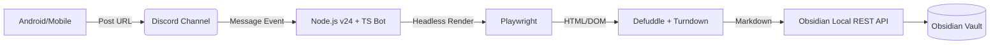

# 🚀 Discord-to-Obsidian Web Clipper

A seamless "Save to Obsidian" bridge that allows you to clip web articles from your mobile device (Android/iOS) to your desktop Obsidian vault via Discord. Built with **TypeScript** and optimized with **pnpm**.

## 📖 Overview

While the official Obsidian Clipper is fantastic for desktop browsing, clipping content from mobile often involves clunky "Share to..." menus or manual copy-pasting. This system automates the bridge:

1. **Share** a URL to a dedicated Discord channel on your phone.
2. **Process** the URL on your PC using a headless browser (Playwright) and the official Obsidian extraction engine (`defuddle`).
3. **Sync** the beautifully formatted Markdown directly into your Vault via a Local REST API.

---

## 🏗 System Architecture



---

## 📋 Prerequisites

Before setting up the bot, ensure you have the following configured:

### 1. System Environment

* **Node.js**: **Version 24.x (LTS) or higher**.
* **Package Manager**: **[pnpm](https://pnpm.io/)** (Recommended).
* To enable pnpm on Node 24, run: `corepack enable pnpm`

* **Language**: **TypeScript**.
* **Playwright Browsers**: Required for rendering JavaScript-heavy sites.

### 2. Discord Side

* **Discord Developer Account**: [Discord Developer Portal](https://discord.com/developers/applications).
* **Bot Token**: Enable `Message Content Intent` in the Bot settings.
* **Channel ID**: A specific channel where the bot will listen for URLs.

### 3. Obsidian Side

* **Local REST API Plugin**:

1. Install [Local REST API](https://github.com/coddingtonbear/obsidian-local-rest-api) from Community Plugins.
2. Enable the plugin and obtain your **API Key**.

---

## 🛠 Tech Stack

| Component | Technology | Role |
| --- | --- | --- |
| **Runtime** | **Node.js v24 (LTS)** | Modern, fast, and stable execution. |
| **Language** | **TypeScript** | Type-safe development for complex DOM handling. |
| **Trigger** | [Discord.js](https://discord.js.org/) | Listens for mobile shares via Discord. |
| **Browser Engine** | [Playwright](https://playwright.dev/) | Renders the final state of web pages. |
| **Extraction** | [Defuddle](https://www.google.com/search?q=https://github.com/obsidianmd/defuddle) | Obsidian's official content extraction engine. |
| **Integration** | [Local REST API](https://coddingtonbear.github.io/obsidian-local-rest-api/) | Silent background writing to the Vault. |

---

## 🚀 Getting Started

### 1. Installation

```bash
# Enable pnpm via Node 24 Corepack
corepack enable pnpm

# Clone and install dependencies
git clone https://github.com/yourusername/discord-obsidian-clipper.git
cd discord-obsidian-clipper
pnpm install

# Install Playwright browser binaries
pnpx playwright install chromium

```

### 2. Configuration

Create a `.env` file in the root directory:

```env
DISCORD_TOKEN=your_bot_token
DISCORD_CHANNEL_ID=your_channel_id
OBSIDIAN_API_KEY=your_local_rest_api_key
OBSIDIAN_PORT=27124
DESTINATION_FOLDER=Clippings/

```

### 3. Running the Bot

```bash
# Development mode
pnpm run dev

# Build and Start
pnpm run build
pnpm start

```

---

## ✨ Why this Architecture?

### 🧩 Direct Use of Obsidian Clipper Logic (`defuddle`)

Instead of using generic scrapers, this project calls the **official Obsidian extraction engine (`defuddle`)** directly within Node.js.

* **Consistency**: Ensures the clipped Markdown is identical in quality and structure to the official browser extension.
* **Parity**: Benefit from the same site-specific rules (GitHub, YouTube, etc.) that the Obsidian team maintains.
* **Metadata**: Accurately extracts JSON-LD and Schema.org data exactly how Obsidian expects it.

### 📱 Discord as a Universal Mobile Bridge

Mobile OS restrictions make it difficult to trigger desktop apps directly.

* **Ubiquity**: Discord is available on every mobile device and provides an effortless "Share to..." target.
* **Persistent Inbox**: Acts as a queue. Even if your PC is offline, the URLs wait in the Discord channel until the bot processes them.
* **Low Latency**: Real-time event triggers ensure the clip appears in your Vault seconds after posting.

### 🏗 TypeScript & pnpm

* **Zero Ghost Dependencies**: pnpm ensures that only the packages you explicitly add are accessible, preventing runtime bugs.
* **Disk Efficiency**: Uses content-addressable storage to save GBs of disk space across projects.
* **Type Safety**: TypeScript handles the complex JSON structures from Discord and the DOM with robust error checking.
