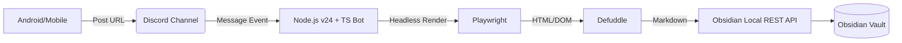

# 🚀 Obsidian Remote Clipper

Clip web content anywhere to your Obsidian Vault via Discord, formatting into perfect Markdown using the official extraction engine.

## 📖 Overview

While the official Obsidian Clipper is fantastic for desktop browsing, clipping content from mobile often involves clunky "Share to..." menus or manual copy-pasting. This system automates the bridge:

1. **Share** a URL to a dedicated Discord channel on your phone.
2. **Process** the URL on your PC using a headless browser (Playwright) and the official Obsidian extraction engine (`defuddle`).
3. **Sync** the beautifully formatted Markdown directly into your Vault via a Local REST API.

---

## 🏗 System Architecture



### 🧠 Design Principle: Stateless

This system is designed to be **fully stateless**.

* **Discord Channel as Queue**: Unprocessed URLs remain as messages in the Discord channel. Even if the bot goes offline, they are preserved and can be processed upon restart.
* **No State in Bot/Clipper**: No database or file-based queue is maintained. All state relies solely on Discord's message history.
* **Duplicate-Tolerant**: Clipping the same URL multiple times is allowed — each clip is saved with a unique filename.

---

## 📋 Prerequisites

Before setting up the bot, ensure you have the following configured:

### 1. System Environment

* **Node.js**: **Version 24.x (LTS) or higher**.
* **Package Manager**: **[pnpm](https://pnpm.io/)** (Recommended).
  * To enable pnpm on Node 24, run: `corepack enable pnpm`
* **Language**: **TypeScript**.
* **Playwright Browsers**: Required for rendering JavaScript-heavy sites.

### 2. Discord Side

* **Discord Developer Account**: [Discord Developer Portal](https://discord.com/developers/applications).
* **Bot Token**: Create a Bot in the Developer Portal.
* **Bot Configuration** (Developer Portal → Bot Settings):
  * ✅ **`MESSAGE CONTENT INTENT`** must be toggled ON (this is a Privileged Intent and must be manually enabled).
* **Channel ID**: A specific channel where the bot will listen for URLs.
* **Required Bot Permissions**:
  * `Read Message History` — Read past messages in the channel
  * `Send Messages` — Reply with status or error messages
  * `View Channels` — Access the monitored channel
  * `Add Reactions` — Notify processing status via reactions (✅/❌)

#### Discord.js Configuration

```typescript
import { Client, GatewayIntentBits } from 'discord.js';

const client = new Client({
  intents: [
    GatewayIntentBits.Guilds,          // Access to guild information
    GatewayIntentBits.GuildMessages,    // Receive message events
    GatewayIntentBits.MessageContent,   // Read message content (Privileged)
  ],
});
```

#### URL Detection Logic

URLs are extracted from message content using a regular expression:

```typescript
const URL_REGEX = /https?:\/\/[^\s<>]+/gi;
const urls = message.content.match(URL_REGEX) ?? [];
```

* If a single message contains **multiple URLs**, each is clipped individually.
* Non-URL text in the message is ignored.

### 3. Obsidian Side

* **Local REST API Plugin**:
  1. Install [Local REST API](https://github.com/coddingtonbear/obsidian-local-rest-api) from Community Plugins.
  2. Enable the plugin and obtain your **API Key**.
  3. ⚠️ **Obsidian must be running on your desktop** (Local REST API runs within the Obsidian process).

---

## 🛠 Tech Stack

| Component | Technology | Role |
| --- | --- | --- |
| **Runtime** | **Node.js v24 (LTS)** | Modern, fast, and stable execution. |
| **Language** | **TypeScript** | Type-safe development for complex DOM handling. |
| **Trigger** | [Discord.js](https://discord.js.org/) v14 | Listens for mobile shares via Discord. |
| **Browser Engine** | [Playwright](https://playwright.dev/) | Renders the final state of web pages (SPA support). |
| **Extraction** | [Defuddle](https://github.com/kepano/defuddle) | Obsidian's official content extraction engine with built-in Markdown conversion. |
| **Integration** | [Local REST API](https://coddingtonbear.github.io/obsidian-local-rest-api/) | Silent background writing to the Vault. |

---

## 📡 Obsidian Local REST API Specification

The bot uses the **Vault Files** endpoints of the Local REST API to save clips to the Vault.

### Authentication

All requests require a Bearer Token:

```
Authorization: Bearer {OBSIDIAN_API_KEY}
```

### Endpoint Used

#### `PUT /vault/{filePath}` — Create or Overwrite a File

Creates a new file in the vault or overwrites an existing one.

```http
PUT {OBSIDIAN_API_URL}vault/Clippings/Example-Article_a1b2c3.md
Content-Type: text/markdown
Authorization: Bearer {API_KEY}

---
title: "Example Article"
source: "https://example.com/article"
author: "John Doe"
clipped: "2026-02-24T12:00:00+09:00"
---

# Example Article

Article content in Markdown...
```

| Response | Meaning |
| --- | --- |
| `204 No Content` | Success |
| `400 Bad Request` | Invalid filename or Content-Type |
| `405 Method Not Allowed` | Path points to a directory |

### Base URL

```
http://localhost:27124
```

> ℹ️ HTTP is used since this system runs locally.

---

## 📁 File Naming Convention

Markdown files saved to the Vault follow this naming pattern:

```
{sanitized-title}_{short-hash}.md
```

### Components

| Element | Description | Example |
| --- | --- | --- |
| `sanitized-title` | Page title with invalid filename characters removed/replaced | `Example-Article` |
| `short-hash` | Short hash generated from URL + timestamp (6 characters) | `a1b2c3` |

### Uniqueness Guarantee

* The **short hash** is derived from `URL + millisecond timestamp at clip time` (e.g., first 6 characters of SHA-256).
* Since the timestamp differs for each clip, **filenames are always unique** — even when clipping the same URL multiple times.
* Sanitization replaces `/ \ : * ? " < > |` with hyphens and collapses consecutive hyphens into one.

---

## ⚠️ Error Handling Strategy

Following the stateless design, all processing results are communicated via **Discord reactions**.

| Scenario | Behavior | Discord Notification |
| --- | --- | --- |
| ✅ Clip successful | Markdown saved to Vault | ✅ Reaction |
| 🌐 Site returns an error (403/500, etc.) | Error details are saved as a clip (viewable in Obsidian) | ⚠️ Reaction |
| 🔌 Obsidian / Local REST API unreachable | Clip is NOT saved. URL remains in Discord as a queue item | ❌ Reaction + error message reply |
| 🤖 Bot is offline | URLs accumulate in the Discord channel. Processed when bot restarts | — |

### Unprocessed Message Recovery on Startup

When the bot starts, it scans recent messages in the monitored channel and processes any messages that do **not** have a bot reaction (✅/⚠️/❌), treating them as unprocessed.

---

## 🚀 Getting Started

### 1. Installation

```bash
# Enable pnpm via Node 24 Corepack
corepack enable pnpm

# Clone and install dependencies
git clone https://github.com/yourusername/discord-obsidian-clipper.git
cd discord-obsidian-clipper
pnpm install

# Install Playwright browser binaries
pnpx playwright install chromium
```

### 2. Configuration

Create a `.env` file in the root directory:

```env
DISCORD_TOKEN=your_bot_token
DISCORD_CHANNEL_ID=your_channel_id
OBSIDIAN_API_KEY=your_local_rest_api_key
OBSIDIAN_PORT=27124
DESTINATION_FOLDER=Clippings/
```

### 3. Running the Bot

```bash
# Development mode
pnpm run dev

# Build and Start
pnpm run build
pnpm start
```

---

## ✨ Why this Architecture?

### 🧩 Direct Use of Obsidian Clipper Logic (`defuddle`)

Instead of using generic scrapers, this project calls the **official Obsidian extraction engine (`defuddle`)** directly within Node.js. The `defuddle/node` bundle supports built-in Markdown conversion via the `markdown: true` option, eliminating the need for a separate Turndown dependency.

* **Consistency**: Ensures the clipped Markdown is identical in quality and structure to the official browser extension.
* **Parity**: Benefit from the same site-specific rules (GitHub, YouTube, etc.) that the Obsidian team maintains.
* **Metadata**: Accurately extracts JSON-LD and Schema.org data exactly how Obsidian expects it.
* **Built-in Markdown**: `defuddle/node` includes Markdown conversion — no separate converter needed.

### 📱 Discord as a Universal Mobile Bridge

Mobile OS restrictions make it difficult to trigger desktop apps directly.

* **Ubiquity**: Discord is available on every mobile device and provides an effortless "Share to..." target.
* **Persistent Inbox**: Acts as a queue. Even if your PC is offline, the URLs wait in the Discord channel until the bot processes them.
* **Low Latency**: Real-time event triggers ensure the clip appears in your Vault seconds after posting.

### 🏗 TypeScript & pnpm

* **Zero Ghost Dependencies**: pnpm ensures that only the packages you explicitly add are accessible, preventing runtime bugs.
* **Disk Efficiency**: Uses content-addressable storage to save GBs of disk space across projects.
* **Type Safety**: TypeScript handles the complex JSON structures from Discord and the DOM with robust error checking.

## License

This project is licensed under the [MIT License](LICENSE).

## Author

Daisuke (yet another) Maki ([GitHub](https://github.com/Maki-Daisuke))
