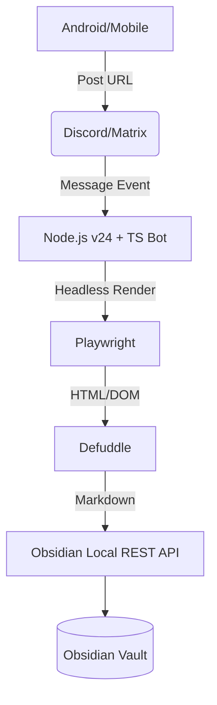

# System Architecture

The Obsidian Remote Clipper is a stateless bridge that captures web content via chat services (like Discord) and saves it as beautifully formatted Markdown in an Obsidian Vault.

## Design Principle: Stateless

This system is designed to be **fully stateless**.

- **Chat Channel as Queue**: Unprocessed URLs remain as messages in your Discord channel or Matrix room. Even if the bot goes offline, they are preserved and can be processed upon restart.
- **No State in Bot/Clipper**: No database or file-based queue is maintained. All state relies solely on the chat's message history and reaction state.
- **Duplicate-Tolerant**: Clipping the same URL multiple times is allowed — each clip is saved with a unique filename.

The reasoning behind this choice is captured in [Rationales](rationales.md).

## Tech Stack

| Component          | Technology                                                                  | Role                                                                             |
| ------------------ | --------------------------------------------------------------------------- | -------------------------------------------------------------------------------- |
| **Runtime**        | **Node.js v24 (LTS)**                                                       | Modern, fast, and stable execution.                                              |
| **Language**       | **TypeScript**                                                              | Type-safe development for complex DOM handling.                                  |
| **Trigger**        | Discord.js / matrix-bot-sdk                                                 | Listens for mobile shares via chat app APIs.                                     |
| **Browser Engine** | [Playwright](https://playwright.dev/)                                       | Renders the final state of web pages (SPA support).                              |
| **Extraction**     | [Defuddle](https://github.com/kepano/defuddle)                              | Obsidian's official content extraction engine with built-in Markdown conversion. |
| **Integration**    | [Local REST API](https://github.com/coddingtonbear/obsidian-local-rest-api) | Silent background writing to the Vault.                                          |

## Related concepts

- [Bot Layer](bot-layer.md)
- [Clipping Pipeline](clipping-pipeline.md)
- [Obsidian Integration](obsidian-integration.md)

Back to [index](index.md).
