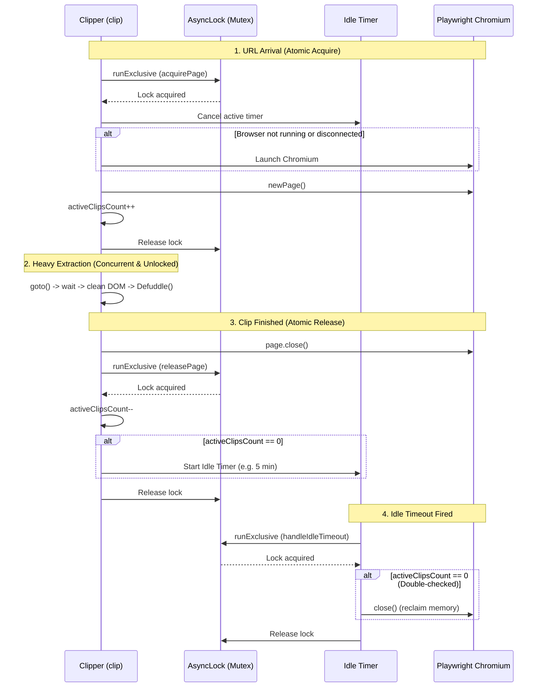

# Clipping Pipeline (`clipper.ts`)

- **Rendering Strategy**: Uses Playwright to load the page and waits for JS-rendered content to settle so SPA/JavaScript-heavy content is fully rendered.
- **Redirect Tracking**: Always uses the final redirected URL (`page.url()`) for metadata, ensuring short URLs (e.g., `share.google`) are resolved.
- **Extraction**: Passes the rendered HTML and final URL to `defuddle` with `markdown: true`.

## Content Cleanup Before Extraction

Before serializing the DOM for extraction, the pipeline removes elements that are not visually rendered (`display: none` / `visibility: hidden`).

- **Why**: Some sites embed several hidden paywall/newsletter state messages in the DOM. Left in place, these dense hidden blocks can trick Defuddle into extracting them instead of the visible article body.
- **Effect**: Extraction reflects what a signed-in reader actually sees. This is a general improvement, not tied to any single site.

## Authenticated Clipping (Persistent Profile)

To clip pages that require a login, the clipper can reuse a dedicated, pre-authenticated browser profile.

- **Opt-in via `CHROME_USER_DATA_DIR`**: When set, the clipper uses `chromium.launchPersistentContext(userDataDir, ...)` instead of a fresh `chromium.launch()`. When unset, it falls back to the stateless launch.
- **One-time manual login**: The helper script (`misc/chrome_login.ts`, run via `pnpm run login`) opens the same profile **headed** (`headless: false`) so the user can log in by hand. The session (cookies, `indexedDB`, `sessionStorage`) is persisted to the profile directory on disk.
- **Why a persistent context, not `storageState`**: `storageState` only captures cookies + `localStorage`. Many auth-walled sites keep tokens in `indexedDB`/`sessionStorage`, which a persistent user-data directory preserves in full — avoiding the "logs out immediately after login" problem.
- **Dedicated profile**: A separate profile directory (default `./.playwright/.chrome-clipper`, git-ignored) is used rather than the user's everyday browser profile. Sharing a live profile risks `SingletonLock` conflicts and profile corruption.

## Browser Selection

Both the login helper and the clipper use Playwright's **bundled Chromium** on every platform (no `channel` is set), via a shared `launchClipperContext` helper (`src/browser.ts`):

```typescript
await chromium.launchPersistentContext(userDataDir, {
  headless /* no channel */,
});
```

- **Why not the `msedge` channel on Windows**: An earlier version used Edge on Windows, assuming the bundled `chrome-headless-shell` popped up a "DOS window". This was measured and found to be **false** for current Playwright (1.63 / Chromium 153): bundled Chromium spawns **no** extra window or `conhost`, whereas the `msedge` new-headless mode spawns a lingering blank window (and an extra `conhost`) that can even outlive the process. Bundled Chromium is therefore the cleaner choice.
- **No extra install**: Using bundled Chromium requires no Google Chrome/Edge installation and keeps the setup self-contained across macOS, Linux, and Windows.
- **Consistency requirement**: The login helper and the clipper's persistent path **must** resolve to the same browser binary. A Chromium user-data directory embeds a version marker; opening a profile created by one binary with a different one can trigger warnings or corruption. Sharing one launch helper guarantees login and clip always match.

## Browser Lifecycle & Idle Timeout

To balance responsiveness with memory consumption, the clipper uses an **idle timeout with asynchronous mutex synchronization** (`AsyncLock`):

- **Lazy Launch & Reuse**: The browser is launched lazily on the first URL clip and kept alive across subsequent requests to eliminate the multi-second startup overhead.
- **Configurable Idle Shutdown**: When the bot remains idle without active clipping jobs for longer than `BROWSER_IDLE_TIMEOUT_SECONDS` (default: 300 seconds / 5 minutes), the browser is automatically closed to reclaim memory. Setting the value to `0` keeps the browser alive indefinitely.
- **Race Condition Prevention via Mutex (`AsyncLock`)**:
  - Browser lifecycle transitions (launching, page creation, closing, and timer arming/disarming) are strictly serialized through an `AsyncLock` powered by `Promise.withResolvers()`.
  - Heavy page rendering and content extraction occur outside the lock, allowing concurrent clip requests.
  - If a new clip request arrives while the idle timer is firing or closing the browser, the lock guarantees clean shutdown before launching a new instance, preventing `SingletonLock` conflicts or invalid handle errors.



## Related concepts

- [Architecture](architecture.md)
- [File Naming](file-naming.md)
- [Rationales](rationales.md)

Back to [index](index.md).
