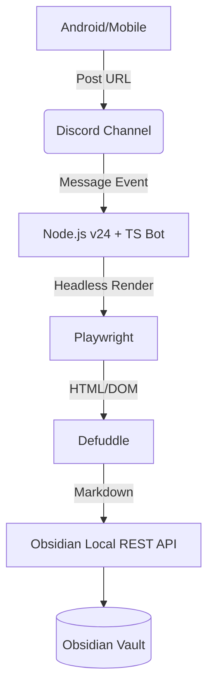

# Obsidian Remote Clipper — System Design

This document outlines the architecture, tech stack, and design patterns used in **Obsidian Remote Clipper**.
For installation and basic usage, please refer to the [README](../README.md).

## System Architecture

The Obsidian Remote Clipper is a stateless bridge that captures web content via chat services (like Discord) and saves it as beautifully formatted Markdown in an Obsidian Vault.



### Design Principle: Stateless

This system is designed to be **fully stateless**.

* **Discord Channel as Queue**: Unprocessed URLs remain as messages in the Discord channel. Even if the bot goes offline, they are preserved and can be processed upon restart.
* **No State in Bot/Clipper**: No database or file-based queue is maintained. All state relies solely on Discord's message history.
* **Duplicate-Tolerant**: Clipping the same URL multiple times is allowed — each clip is saved with a unique filename.

## Tech Stack

| Component | Technology | Role |
| --- | --- | --- |
| **Runtime** | **Node.js v24 (LTS)** | Modern, fast, and stable execution. |
| **Language** | **TypeScript** | Type-safe development for complex DOM handling. |
| **Trigger** | [Discord.js](https://discord.js.org/) v14 | Listens for mobile shares via Discord. |
| **Browser Engine** | [Playwright](https://playwright.dev/) | Renders the final state of web pages (SPA support). |
| **Extraction** | [Defuddle](https://github.com/kepano/defuddle) | Obsidian's official content extraction engine with built-in Markdown conversion. |
| **Integration** | [Local REST API](https://github.com/coddingtonbear/obsidian-local-rest-api) | Silent background writing to the Vault. |

## Component Design

### 1. Bot Abstract Layer

To support multiple chat platforms (Slack, Matrix, etc.), the bot logic is abstracted behind an interface and a class factory method.

#### Interface: `Bot`

Utilizes `Symbol.asyncDispose` (TypeScript 5.2+) for automatic resource management.

```typescript
export type ProcessResult = "success" | "warning" | "error";

export interface Bot extends AsyncDisposable {
  destroy(): Promise<void>;
}
```

#### Class: `DiscordBot`

Encapsulates Discord-specific logic. Initializes the client, sets up listeners, and handles startup recovery.

```typescript
export class DiscordBot implements Bot {
  static create(
    processURL: (url: string) => Promise<ProcessResult>,
    conf: { token: string; channelId: string }
  ): Promise<DiscordBot> {
    // 1. Initialize Discord client
    // 2. Scan for unprocessed messages (Stateless Recovery)
    // 3. Set up MessageCreate listener
    // 4. Return initialized DiscordBot instance
  }
}
```

#### URL Detection Logic

URLs are extracted from message content using a regular expression:

```typescript
const URL_REGEX = /https?:\/\/[^\s<>]+/gi;
const urls = message.content.match(URL_REGEX) ?? [];
```

* If a single message contains **multiple URLs**, each is clipped individually.
* Non-URL text in the message is ignored.

### 2. Clipping Pipeline (`clipper.ts`)

* **Rendering Strategy**: Uses Playwright's `load` status + a fixed 2s delay to ensure SPA/JavaScript-heavy content is fully rendered.
* **Redirect Tracking**: Always uses the final redirected URL (`page.url()`) for metadata, ensuring short URLs (e.g., `share.google`) are resolved.
* **Extraction**: Passes the rendered HTML and final URL to `defuddle` with `markdown: true`.

### 3. File Naming Convention (`filename.ts`)

Markdown files saved to the Vault follow this naming pattern:

```
{sanitized-title} - {timestamp}.md
```

#### Components

| Element | Description | Example |
| --- | --- | --- |
| `sanitized-title` | Page title with invalid filename characters removed/replaced | `Example-Article` |
| `timestamp` | Timestamp string generated at clip time (`YYYYMMDD_HHMMSS`) | `20260226_123456` |

#### Uniqueness Guarantee

* The **timestamp** is derived from the system time at clip time (`YYYYMMDD_HHMMSS`).
* Since the timestamp differs down to the second, **filenames are highly likely to be unique** — even when clipping the same URL multiple times.
  * This ensures that clipping the same page again (or different pages that happen to have the identical title) will not accidentally overwrite existing files in your Vault.
* Sanitization replaces `/ \ : * ? " < > |` with hyphens and collapses consecutive hyphens into one.

### 4. Obsidian Integration (`obsidian.ts`)

The bot uses the **Vault Files** endpoints of the Local REST API to save clips to the Vault.

#### Authentication

All requests require a Bearer Token:

```http
Authorization: Bearer {OBSIDIAN_API_KEY}
```

#### Endpoint Used

**`PUT {OBSIDIAN_API_URL}vault/{filePath}` — Create or Overwrite a File**

Creates a new file in the vault or overwrites an existing one.

```http
PUT /vault/Clippings/Example-Article - 20260224_120000.md
Content-Type: text/markdown
Authorization: Bearer {API_KEY}

---
title: "Example Article"
source: "https://example.com/article"
author: "John Doe"
clipped: "2026-02-24T12:00:00+09:00"
---

# Example Article

Article content in Markdown...
```

| Response | Meaning |
| --- | --- |
| `204 No Content` | Success |
| `400 Bad Request` | Invalid filename or Content-Type |
| `405 Method Not Allowed` | Path points to a directory |

#### Connection Configuration

The base URL is configured via `OBSIDIAN_API_URL` (e.g., `http://127.0.0.1:27123/`).
> ℹ️ If you use HTTPS with a self-signed certificate, you must set `NODE_TLS_REJECT_UNAUTHORIZED=0` in your environment.

## Error Handling Strategy

Following the stateless design, all processing results are communicated via **Discord reactions**.

| Tier        | Scenario                        | Behavior                                                    | Discord Notification              |
| ----------- | ------------------------------- | ----------------------------------------------------------- | --------------------------------- |
| **Success** | Clip successful                 | Markdown saved to Vault                                     | ✅ Reaction                       |
| **Site**    | 403 / 500 / Timeout             | Error details saved as a clip (viewable in Obsidian)        | ⚠️ Reaction                       |
| **Storage** | Obsidian API unreachable        | Clip is NOT saved. URL remains in Discord as a queue item   | ❌ Reaction + error message reply |
| **System**  | Bot is offline                  | URLs accumulate in the channel. Processed when bot restarts | —                                 |

### Unprocessed Message Recovery on Startup

When the bot starts, it scans recent messages in the monitored channel and processes any messages that do **not** have a bot reaction (✅/⚠️/❌), treating them as unprocessed.

## Rationales

### Discord as a Universal Mobile Bridge

Mobile OS restrictions make it difficult to trigger desktop apps directly.

* **Ubiquity**: Discord is available on every mobile device and provides an effortless "Share to..." target.
* **Persistent Inbox**: Acts as a queue. Even if your PC is offline, the URLs wait in the Discord channel until the bot processes them.
* **Low Latency**: Real-time event triggers ensure the clip appears in your Vault seconds after posting.
* **Zero Server Maintenance**: By leveraging Discord and your local PC, there is no need to rent or maintain an external VPS or cloud server. The entire pipeline runs securely and privately within your existing environment.
* **Stateless Clipper**: Because Discord retains the message history and acts as the persistent queue, the Obsidian Remote Clipper itself requires zero state management (no database or file-based queue), dramatically simplifying the architecture.

### Implemented in TypeScript

* **Type Safety for DOM/API Structures**: TypeScript's strict typing ensures robust structure validation at compile time.
* **Modern Node.js Features**: Using Node.js v24 allows for leveraging modern ECMAScript features like `Symbol.asyncDispose` (via TS 5.2+) to guarantee strict and automated cleanup of browser processes and bot connections.
* **Seamless `defuddle` Integration**: Since Obsidian's official `defuddle` package is built for JavaScript/Node.js, writing the bot in TypeScript allows for native, zero-friction integration and identical type definitions.

### Direct Use of Obsidian Clipper Logic (`defuddle`)

Instead of using generic scrapers, this project calls the **official Obsidian extraction engine (`defuddle`)** directly within Node.js. The `defuddle/node` bundle supports built-in Markdown conversion via the `markdown: true` option, eliminating the need for a separate Turndown dependency.

* **Consistency**: Ensures the clipped Markdown is identical in quality and structure to the official browser extension.
* **Metadata**: Accurately extracts JSON-LD and Schema.org data exactly how Obsidian expects it.
* **Built-in Markdown**: `defuddle/node` includes Markdown conversion — no separate converter needed.

### Use of Local REST API instead of Obsidian URL Scheme

While Obsidian provides an `obsidian://new` URI scheme for creating files, this project uses the Local REST API for several critical reasons necessary for a background service:

* **No Focus Stealing**: URL schemes typically force the target application to the foreground. The REST API allows the bot to write files silently in the background without interrupting your active work on the PC.
* **No Payload Limits**: URL schemes have OS-level length limits (often around 2048-8192 characters). Full Markdown articles easily exceed this limit, causing truncated clips. HTTP `PUT` requests handle massive payloads effortlessly.
* **Reliable Feedback**: URL schemes are "fire and forget". The REST API returns standard HTTP status codes, allowing the bot to reliably determine success or failure and provide accurate status reactions (✅/❌) back to Discord.
