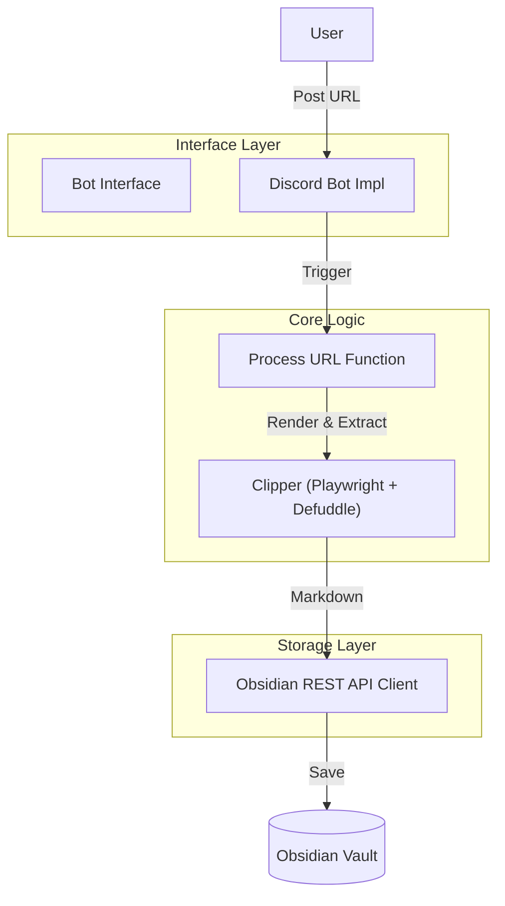

# Obsidian Remote Clipper — System Design

This document outlines the architecture and design patterns used in **Obsidian Remote Clipper**.

## 🏗 System Overview

Obsidian Remote Clipper is a stateless bridge that captures web content via chat services (like Discord) and saves it as beautifully formatted Markdown in an Obsidian Vault using the Local REST API.

### Core Principles

- **Statelessness**: The system maintains no internal state. The monitored chat channel acts as the persistent queue.
- **Extraction Fidelity**: Uses the official Obsidian extraction engine (`defuddle`) to ensure clips are identical to those from the browser extension.
- **Separation of Concerns**: Decouples the message trigger (Bot), the content extraction (Clipper), and the storage (Obsidian client).

## 🧩 Architecture



## 🛠 Component Design

### 1. Bot Abstract Layer

To support multiple chat platforms (Slack, Telegram, etc.), the bot logic is abstracted behind a factory pattern and an interface.

#### Interface: `Bot`

Utilizes `Symbol.asyncDispose` (TypeScript 5.2+) for automatic resource management.

```typescript
export type ProcessResult = "success" | "warning" | "error";

export interface Bot {
  /**
   * Gracefully shuts down the bot and releases resources.
   * Can be used with the 'await using' keyword.
   */
  [Symbol.asyncDispose](): Promise<void>;
}
```

#### Factory: `createDiscordBot`

Initializes the bot, sets up listeners, and handles startup recovery.

```typescript
export async function createDiscordBot(
  processURL: (url: string) => Promise<ProcessResult>,
  conf: Record<string, string>
): Promise<Bot> {
  // 1. Initialize Discord client
  // 2. Scan for unprocessed messages (Stateless Recovery)
  // 3. Set up MessageCreate listener
  // 4. Return Bot object with [Symbol.asyncDispose]
}
```

### 2. Clipping Pipeline (`clipper.ts`)

- **Rendering Strategy**: Uses Playwright's `load` status + a fixed 2s delay to ensure SPA/JavaScript-heavy content (like Qiita) is fully rendered.
- **Redirect Tracking**: Always uses the final redirected URL (`page.url()`) for metadata, ensuring short URLs (e.g., `share.google`) are resolved.
- **Extraction**: Passes the rendered HTML and final URL to `defuddle` with `markdown: true`.

### 3. Filename Generation (`filename.ts`)

- **Pattern**: `{sanitized-title}_{short-hash}.md`
- **Sanitization**: Replaces invalid filesystem characters with hyphens.
- **Uniqueness**: The `short-hash` is the first 6 characters of SHA-256 (`URL + millisecond_timestamp`), allowing duplicate URLs to coexist as unique files.

### 4. Obsidian Integration (`obsidian.ts`)

- **Protocol**: HTTP over `localhost` (default port 27124).
- **Endpoint**: `PUT /vault/{filePath}`.
- **Auth**: Bearer token authentication via API Key.

## 📡 Error Handling Strategy

| Tier | Failure | Action | Bot Notification |
| --- | --- | --- | --- |
| **Site** | 403 / 500 / Timeout | Create "Error Clip" markdown | ⚠️ Reaction |
| **Connection** | Proxy/DNS Failure | Create "Error Clip" markdown | ⚠️ Reaction |
| **Storage** | Obsidian Offline | Stop processing message | ❌ Reaction + Error Reply |

*Note: If the storage layer fails, the message remains "unprocessed" in the chat history, ensuring the URL is not lost.*

## 🚀 Graceful Shutdown

The system handles `SIGINT` and `SIGTERM` signals to:

1. Destroy the Bot client.
2. Close the headless Playwright browser.
3. Exit cleanly.
