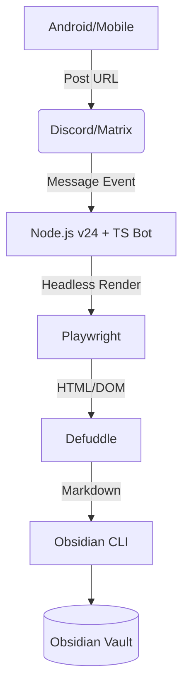

# Obsidian Remote Clipper — System Design

This document outlines the architecture, tech stack, and design patterns used in **Obsidian Remote Clipper**.
For installation and basic usage, please refer to the [README](../README.md).

## System Architecture

The Obsidian Remote Clipper is a stateless bridge that captures web content via chat services (like Discord) and saves it as beautifully formatted Markdown in an Obsidian Vault.


```mermaid
graph TD
    A[Android/Mobile] -- "Post URL" --> B(Discord/Matrix)
    B -- "Message Event" --> C[Node.js v24 + TS Bot]
    C -- "Headless Render" --> D[Playwright]
    D -- "HTML/DOM" --> E[Defuddle]
    E -- "Markdown" --> F[Obsidian CLI]
    F --> G[(Obsidian Vault)]
```

### Design Principle: Stateless

This system is designed to be **fully stateless**.

* **Chat Channel as Queue**: Unprocessed URLs remain as messages in your Discord channel or Matrix room. Even if the bot goes offline, they are preserved and can be processed upon restart.
* **No State in Bot/Clipper**: No database or file-based queue is maintained. All state relies solely on the chat's message history and reaction state.
* **Duplicate-Tolerant**: Clipping the same URL multiple times is allowed — each clip is saved with a unique filename.

## Tech Stack

| Component | Technology | Role |
| --- | --- | --- |
| **Runtime** | **Node.js v24 (LTS)** | Modern, fast, and stable execution. |
| **Language** | **TypeScript** | Type-safe development for complex DOM handling. |
| **Trigger** | Discord.js / matrix-bot-sdk | Listens for mobile shares via chat app APIs. |
| **Browser Engine** | [Playwright](https://playwright.dev/) | Renders the final state of web pages (SPA support). |
| **Extraction** | [Defuddle](https://github.com/kepano/defuddle) | Obsidian's official content extraction engine with built-in Markdown conversion. |
| **Integration** | **Obsidian CLI** | Native integration via the `obsidian create` and `obsidian append` commands. |

## Component Design

### 1. Bot Abstract Layer

To support multiple chat platforms (Discord, Matrix, etc.), the bot logic is abstracted behind an interface and a class factory method (`src/bot-factory.ts`).

#### Interface: `Bot`

Utilizes `Symbol.asyncDispose` (TypeScript 5.2+) for automatic resource management.

```typescript
export type ProcessResult = "success" | "warning" | "error";

export interface Bot extends AsyncDisposable {
  destroy(): Promise<void>;
}
```

#### Bot Implementations

* **`DiscordBot`**: Encapsulates Discord-specific logic using `discord.js`.
* **`MatrixBot`**: Encapsulates Matrix logic using `matrix-bot-sdk`, including Native Node.js bindings via Rust for decrypting End-to-End Encrypted (E2EE) rooms.

Both connect to their respective services, scan for unprocessed historical messages upon startup (Stateless Recovery), and set up message listeners to trigger the clipper.

#### URL Detection Logic

URLs are extracted from message content using a regular expression:

```typescript
const URL_REGEX = /https?:\/\/[^\s<>]+/gi;
const urls = message.content.match(URL_REGEX) ?? [];
```

* If a single message contains **multiple URLs**, each is clipped individually.
* Non-URL text in the message is ignored.

### 2. Clipping Pipeline (`clipper.ts`)

* **Rendering Strategy**: Uses Playwright's `load` status + a fixed 2s delay to ensure SPA/JavaScript-heavy content is fully rendered.
* **Redirect Tracking**: Always uses the final redirected URL (`page.url()`) for metadata, ensuring short URLs (e.g., `share.google`) are resolved.
* **Extraction**: Passes the rendered HTML and final URL to `defuddle` with `markdown: true`.

### 3. File Naming Convention (`filename.ts`)

Markdown files saved to the Vault follow this naming pattern:

```text
{sanitized-title} - {timestamp}.md
```

#### Components

| Element | Description | Example |
| --- | --- | --- |
| `sanitized-title` | Page title with invalid filename characters removed/replaced | `Example-Article` |
| `timestamp` | Timestamp string generated at clip time (`YYYYMMDD_HHMMSS`) | `20260226_123456` |

#### Uniqueness Guarantee

* The **timestamp** is derived from the system time at clip time (`YYYYMMDD_HHMMSS`).
* Since the timestamp differs down to the second, **filenames are highly likely to be unique** — even when clipping the same URL multiple times.
  * This ensures that clipping the same page again (or different pages that happen to have the identical title) will not accidentally overwrite existing files in your Vault.
* Sanitization replaces `/ \ : * ? " < > |` with hyphens and collapses consecutive hyphens into one.

### 4. Obsidian Integration (`obsidian.ts`)

The bot uses the built-in **Obsidian CLI** (`obsidian` command available in v1.12+) to save clips to the Vault via local IPC.

#### Commands Used

* **`obsidian create path={path} content={frontmatter}`**: Creates a new file at the specified path within the vault. In order to avoid the insertion of a single newline at the top of the file, the frontmatter (the very first chunk) is applied directly to the content parameter during the create process.
* **`obsidian append path={path} content={chunk}`**: Appends text to the created file.

#### Chunking for Length Constraints

Because Windows command line arguments are typically limited to ~8191 characters, long articles cannot be passed in a single CLI command. To solve this, the Markdown text is divided into chunks (e.g., 4000 characters). The first chunk is used to create the note, and subsequent chunks are appended iteratively using `obsidian append`.

To ensure the Markdown is not cut arbitrarily in the middle of a word or format, the chunking algorithm calculates slice points by scanning for newlines (`indexOf('\n')`). It aggregates lines up to the safe character limit, then cleanly splits the content at the line boundary. In the rare case where a single continuous line exceeds the limit (such as a massive Base64 string), it is safely hard-sliced.

#### Connection Configuration

If your system has multiple Vaults or different naming structures, you can configure the target vault via `OBSIDIAN_VAULT` in your `.env` file.

## Error Handling Strategy

Following the stateless design, all processing results are communicated via **Discord reactions**.

| Tier        | Scenario                        | Behavior                                                    | Discord Notification              |
| ----------- | ------------------------------- | ----------------------------------------------------------- | --------------------------------- |
| **Success** | Clip successful                 | Markdown saved to Vault                                     | ✅ Reaction                       |
| **Site**    | 403 / 500 / Timeout             | Error details saved as a clip (viewable in Obsidian)        | ⚠️ Reaction                       |
| **Storage** | Obsidian application closed     | Clip is NOT saved. URL remains in Discord as a queue item   | ❌ Reaction + error message reply |
| **System**  | Bot is offline                  | URLs accumulate in the channel. Processed when bot restarts | —                                 |

### Unprocessed Message Recovery on Startup

When the bot starts, it scans recent messages in the monitored channel and processes any messages that do **not** have a bot reaction (✅/⚠️/❌), treating them as unprocessed.

## Rationales

### Chat Platforms as Universal Mobile Bridges

Mobile OS restrictions make it difficult to trigger desktop apps directly.

* **Ubiquity**: Apps like Discord or Matrix (ElementX) are available on every mobile device and provide effortless "Share to..." targets.
* **Persistent Inbox / Queuing**: Even if your PC is offline, the URLs wait in the chat channel until the bot restarts and catches up via synchronization or historical message reading.
* **Low Latency**: Real-time event triggers ensure the clip appears in your Vault seconds after posting.
* **Zero Server Maintenance**: By leveraging your existing chat infrastructure and local PC, there is no need to rent or maintain an external VPS or cloud server.
* **Stateless Clipper**: Because the chat server retains the message history and acts as the persistent queue, the Obsidian Remote Clipper itself requires zero internal state management, dramatically simplifying the architecture.

### Implemented in TypeScript

* **Type Safety for DOM/API Structures**: TypeScript's strict typing ensures robust structure validation at compile time.
* **Modern Node.js Features**: Using Node.js v24 allows for leveraging modern ECMAScript features like `Symbol.asyncDispose` (via TS 5.2+) to guarantee strict and automated cleanup of browser processes and bot connections.
* **Seamless `defuddle` Integration**: Since Obsidian's official `defuddle` package is built for JavaScript/Node.js, writing the bot in TypeScript allows for native, zero-friction integration and identical type definitions.

### Direct Use of Obsidian Clipper Logic (`defuddle`)

Instead of using generic scrapers, this project calls the **official Obsidian extraction engine (`defuddle`)** directly within Node.js. The `defuddle/node` bundle supports built-in Markdown conversion via the `markdown: true` option, eliminating the need for a separate Turndown dependency.

* **Consistency**: Ensures the clipped Markdown is identical in quality and structure to the official browser extension.
* **Metadata**: Accurately extracts JSON-LD and Schema.org data exactly how Obsidian expects it.
* **Built-in Markdown**: `defuddle/node` includes Markdown conversion — no separate converter needed.

### Native Obsidian CLI over URI schemes or REST Plugins

This project interacts with Obsidian using its official CLI, rather than depending on external community REST plugins, or the `obsidian://new` URI schemes:

* **Zero Additional Plugins**: The CLI is a native feature in Obsidian 1.12+, eliminating the need to install, configure, and manage API keys for the Local REST API community plugin.
* **No Focus Stealing**: URL schemes typically force the target application to the foreground. The CLI operates via IPC, writing files and modifying content silently in the background without interrupting your active work on the PC.
* **Bypassing Payload Limits Properly**: URL schemes have strict OS-level length limits (around 2000-8000 characters), which truncates most web articles. While the CLI commands technically share similar OS limits, the system actively mitigates this by streaming and chunking the Markdown payload using iterative `obsidian append` instructions, ensuring flawlessly captured long-form content.
